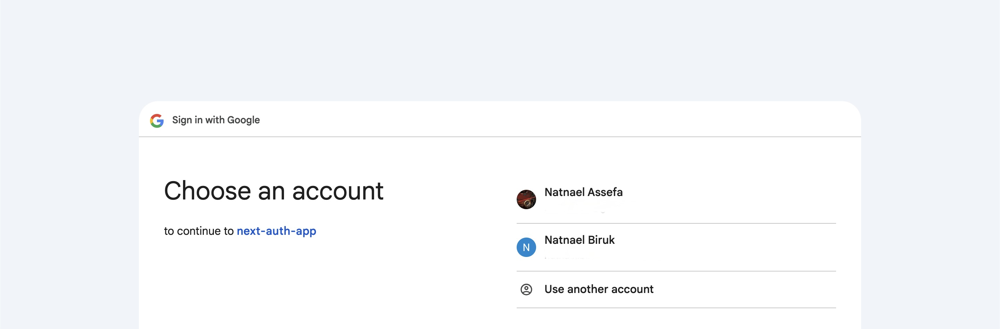
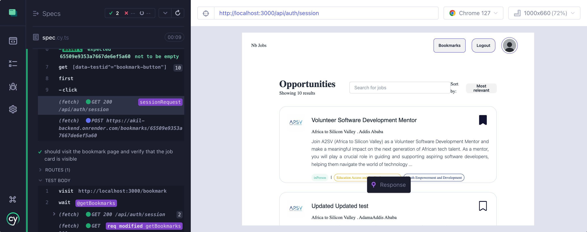
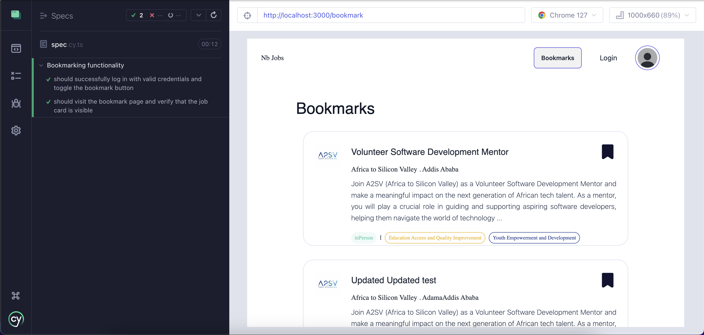
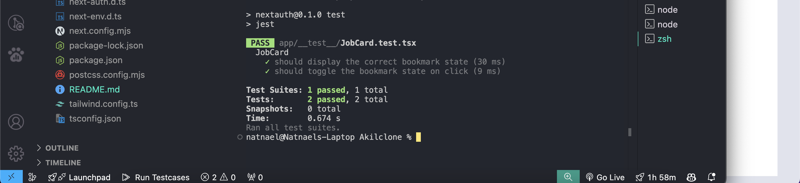

Here’s a revised version of your Markdown file with corrections to the image paths and other minor adjustments for clarity:

````markdown
# Job Listing Platform with Authentication

This project is a job listing platform that integrates user authentication using NextAuth.js, state management using Redux, and job listing functionality with RTK Query. The platform allows users to log in using their Google account, browse job opportunities, and manage their session.

## Table of Contents

- [Features](#features)
- [Technologies](#technologies)
- [Setup](#setup)
- [Usage](#usage)
- [Authentication Flow](#authentication-flow)
- [Job Listing Functionality](#job-listing-functionality)
- [Directory Structure](#directory-structure)

## Features

- User authentication with Google using NextAuth.js
- Job listing with sorting options
- Protected routes that require authentication
- State management with Redux and RTK Query
- Responsive and dynamic user interface

## Technologies

- **Next.js**: Framework for building server-rendered React applications.
- **React**: JavaScript library for building user interfaces.
- **NextAuth.js**: Authentication library for Next.js applications.
- **Redux Toolkit**: State management tool.
- **RTK Query**: Data fetching and caching tool integrated with Redux.
- **Tailwind CSS**: Utility-first CSS framework for styling.
- **Jest**: Unit testing.
- **Cypress**: End-to-end testing.

## Setup

### Prerequisites

- Node.js (>=14.x)
- npm or yarn
- Google Cloud Console account to set up OAuth credentials

### Installation

1. Clone the repository:

   ```bash
   git clone https://github.com/Natib22/auth.git
   cd auth
   cd AkilClone
   ```
````

2. Install dependencies:

   ```bash
   npm install
   ```

3. Create a `.env.local` file in the root directory and add your environment variables:

   ```bash
   NEXTAUTH_URL=http://localhost:3000
   GOOGLE_CLIENT_ID=your_google_client_id
   GOOGLE_CLIENT_SECRET=your_google_client_secret
   NEXTAUTH_SECRET=your_secret
   ```

4. Start the development server:

   ```bash
   npm run dev
   ```

5. Open [http://localhost:3000](http://localhost:3000) in your browser to view the application.

## Usage

### Authentication

- Users can log in using their Google account.
- The application checks the session status and redirects to the login page if the user is not authenticated.
- The session information is accessible through `useSession` from `next-auth/react`.

### Job Listing

- Job data is fetched using RTK Query's `useGetJobsQuery`.
- Jobs can be sorted alphabetically or by relevance.
- The job data is memoized using `useMemo` to prevent unnecessary re-renders.

### Navigation

- The `Nav` component displays different links and a login/logout button based on the user's session state.

## Authentication Flow

1. **Sign In**: Users are prompted to sign in using their Google account via `NextAuth.js`.
2. **Session Handling**: Once authenticated, the session data is managed by NextAuth and made available throughout the application.
3. **Protected Routes**: Pages requiring authentication will redirect users to the login page if they are not logged in.
4. **Sign Out**: Users can sign out, which will terminate their session and redirect them to the homepage or login page.

## Job Listing Functionality

- **Job Data**: Fetched from a backend API using RTK Query.
- **Searching**: Fetched from a backend API using RTK Query.
- **Sorting**: Jobs can be sorted alphabetically or by relevance.
- **UI Components**: Job listings are displayed using the `JobCard` component.

## Directory Structure

```
/app
  - __test__
  - api
  - assets
  - auth
  - bookmark
  - component
  - features
  - job
  - store

/components
  - JobCard.tsx       # Displays individual job details
  - Nav.tsx           # Navigation bar component
  - LoginForm.tsx
  - OtpFrom.tsx
  - SignUpForm.tsx

/features
  /api
    - apiSlice.ts     # RTK Query API slice
    - apiInterface.ts # TypeScript interfaces for job data

  /auth
    - [...nextauth].ts # NextAuth configuration
```

---

Make sure the images are named correctly and placed in the right directory. The `%20` is used for spaces in URLs, so if your file names contain spaces, it’s better to use underscores or dashes for compatibility.


 



.png>)
.png>)



